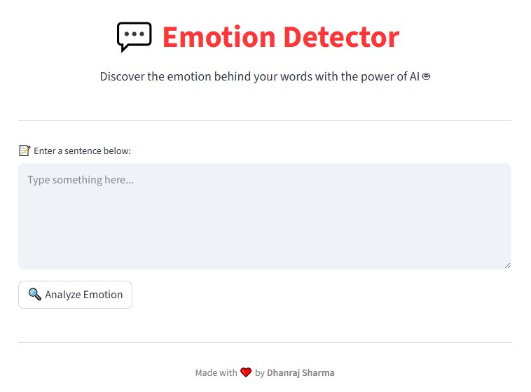
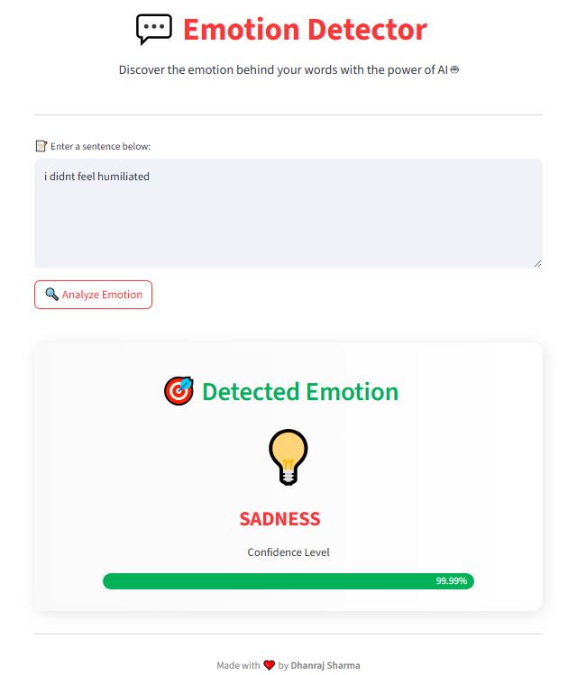
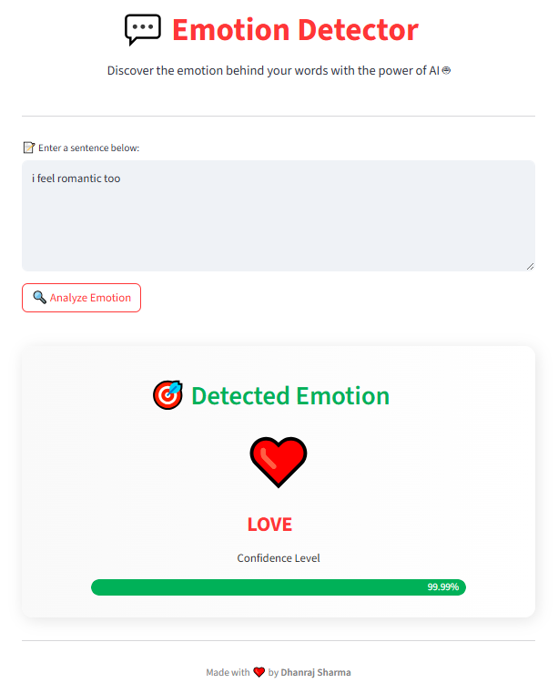
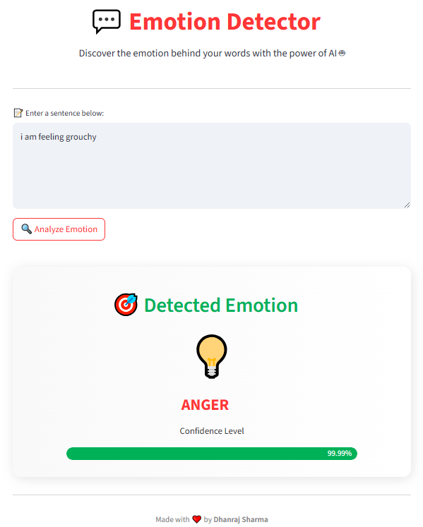
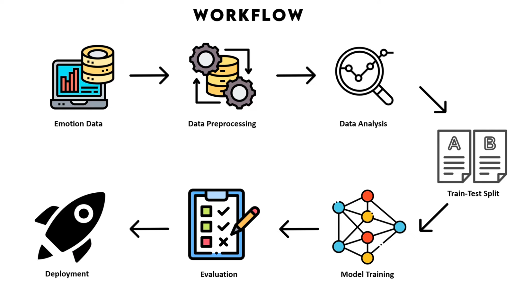

# 😊 Emotion Detection System

> ***Understand human emotions—one sentence at a time.***  
> 🔗 https://your-emotion-detector-app.streamlit.app/ 


### ⚠️ NOTE
This app is trained on a text-based emotion dataset and is for **educational/demo use only**. It does not capture real-time or clinical-level sentiment diagnostics.


## 🌈 App Preview

<p align="center">
  
</p>

## 🧪 Test Cases
<h4>Sad 😢</h4>
<p align="center">
  
</p>

---
<h4>Love ❤️</h4>
<p align="center">
  
</p>

---
<h4>Anger 😠</h4>
<p align="center">
  
</p>

---

## 🎯 Project Overview

**Emotion Detection** is a cutting-edge NLP application that helps identify human emotions based on written text. Whether you’re a developer, psychologist, content creator, or curious user—this AI-powered app lets you peek into the feelings behind the words.

> 💡 Paste a sentence  
> 🎯 Click analyze  
> 😍 Get an instant emotion with emoji + confidence score!

✅ No external APIs  
✅ No manual tagging  
✅ Just clean, trained AI with a modern UI


## 📌 Workflow

- Dataset Loading & Preprocessing
- Label Encoding Emotions
- Tokenization + Padding Sequences
- Class Balancing with **Random OverSampler**
- Model Building with **Bidirectional LSTM**
- Model Training and Evaluation
- Saving Model, Tokenizer & Label Encoder
- Streamlit UI for real-time text emotion analysis

---
<p align="center">
  
</p>

---

## 🧠 How It Works

1. **Text Cleaning:** Removes links, mentions, hashtags, punctuation, and converts text to lowercase.
2. **Tokenization & Padding:** Converts words to numeric sequences and ensures uniform input length.
3. **Balancing:** Uses `RandomOverSampler` to handle class imbalance.
4. **Deep Learning Model:** Bi-directional LSTM layers + Dropout + Dense for final multi-class emotion classification.
5. **Prediction:** Outputs the most likely emotion label and confidence score.


## 🔍 Features

| Function                | Description                                                   |
|-------------------------|---------------------------------------------------------------|
| ✨ Clean UI             | Sleek, modern Streamlit app                                   |
| 💬 Text Preprocessing  | Removes noise for accurate emotion recognition                |
| 🧠 Deep Learning       | Bi-directional LSTM-based sentiment classifier                 |
| 📊 Class Balancing     | Handles data imbalance using RandomOverSampler                |
| 💾 Model Saving        | Model, tokenizer, and encoder saved using `joblib` and Keras   |
| 😄 Emoji Output        | Each emotion visualized with expressive emojis                |
| 🎛️ Confidence Bar     | Displays prediction certainty with a progress bar             |


## 🧪 Model Architecture

- **Embedding Layer**: Converts text to dense vectors  
- **Bidirectional LSTM**: Learns context from both directions  
- **Dropout & BatchNormalization**: Prevents overfitting  
- **Dense Output Layer**: Multi-class classification using softmax


## 📦 Requirements

```txt
pandas
numpy
tensorflow
scikit-learn
matplotlib
imbalanced-learn
joblib
streamlit
```

Install everything using:
```bash
pip install -r requirements.txt
```


## ⚙️ Getting Started

1️⃣ **Clone the repository**
```bash
git clone https://github.com/NDDimension/Emotion-Detection-using-Neural-Network.git
cd Emotion-Detection
```

2️⃣ **Download and prepare your dataset**
- Use a labeled text dataset with columns like `text` and `label`

- Example used: `emotion_dataset.csv`

3️⃣ **Train the Model**
```
Run: emotion.ipynb
```
- The notebook handles:
   - Text preprocessing

   - Label encoding

   - Balancing

   - Tokenization

   - LSTM model training

   - Saving .keras, .jb files

4️⃣ **Run the Streamlit App**
```bash
streamlit run main.py
```

5️⃣ **Use the App**

- Take a sentence from the dataset and try out!

- Click “Analyze Emotion”

- View emotion + emoji + confidence


## ✨ Highlights

- ✅ Bi-LSTM for deeper emotion understanding

- ✅ Balanced training set

- ✅ Modern Streamlit UI

- ✅ Confidence-level visualization

- ✅ Easy model retraining with new datasets


## 🔮 Future Improvements
- 📈 Add multi-label classification (mixed emotions)

- 🧠 Integrate transformer models (e.g., BERT)

- 🎧 Add voice-to-text emotion detection

- 🌍 Multilingual support

- 📱 Responsive mobile UI


## 📊 Sample Output

| Input Text              | Predicted Emotion | Emoji | Confidence |
| ----------------------- | ----------------- | ----- | ---------- |
| "I am so happy today!"  | Happy             | 😊    | 97.5%      |
| "This makes me so sad." | Sad               | 😢    | 93.2%      |


### 🧠 Powered by:

- TensorFlow / Keras

- Scikit-learn

- Pandas

- Streamlit

- Joblib

- Matplotlib 

- Imbalanced-learn


## 📜 License

Licensed under the [MIT License](LICENSE).


> **Emotion Detection System** — *Helping machines understand how we feel.*

> ❤️ Made with love by **Dhanraj Sharma**.
